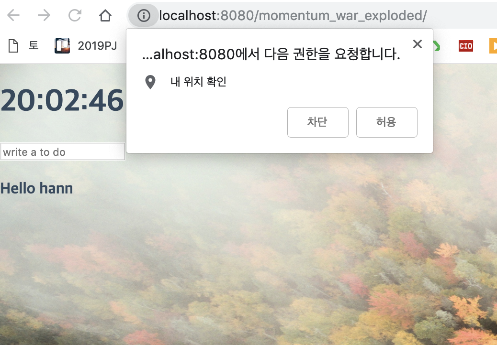

# Clone the Momentum

> [모멘텀](https://momentumdash.com/)을 클론한 본 프로젝트는 NomadCoders를 참고하여 만들었습니다.
> https://academy.nomadcoders.co/courses/category/KR

<br/>
<br/>

#### 개발 환경
- Vanilla Javascript(ECMAScript6)
- Tomcat(9.0.14.0)
- Intellij IDEA

크롬의 인기 확장프로그램인 Momentum을 클론한 프로젝트이며, **Vanilla Javascript** 공부를 목적으로 둡니다.  
Vanilla Javascript에 대한 설명은 여기([Vanilla script](https://github.com/gusdn6526/momentum/blob/master/vanillaJs.md))에 내용을 간단하게 정리해놨습니다. 참고하시면 좋을 거 같습니다.

<br/>

---

<br/>

## 주요기능

<br/>

### LocalStorage를 사용하여 데이터를 get, set 하기
LocalStorage란, 브라우저에서 정보를 간단히 저장하고 사용할 때 유용하게 사용할 수 있습니다.
Cookie를 이후 HTML5에 추가된 저장소이며, Key: Value 스토리지의 형태입니다.
Session Storage도 있는데, 자세한 내용은 [검색](https://www.google.com/search?rlz=1C1GCEU_koKR821KR821&ei=JSR-XJniBcuHoASniLvgDQ&q=local+storage+session+storage%EB%9E%80&oq=local+storage+session+storage%EB%9E%80&gs_l=psy-ab.3..35i39j0j0i22i30l8.870.1471..1619...0.0..0.190.647.0j4......0....1..gws-wiz.......0i71j35i304i39j0i13j0i13i30j0i13i5i30j0i8i13i30.nLvoaT3hrG8) 을 통하여 찾아보시길 바랍니다.


```
localStorage.setItem(USER_LS, text);

const currentUser = localStorage.getItem(USER_LS);
```

이런식으로 사용할 수 있으며, remove()와 clear()를 통하여 정보를 지울 수 있습니다.

<br/>
<br/>

### setInterval() 함수를 사용하여 실시간 Time 보여주기

자바스크립트를 사용하면서 많이 사용되는 함수 중 하나로 setInterval()는 간단하게 사용할 수 있습니다.

```
setInterval(function() { ... }, 지연시간);
```

이런식으로 지연시간을 정해주면 일정 시간마다 반복하면서 작업을 수행합니다.

```
function init() {
    getTime();
    setInterval(getTime, 1000);
}
```

본 clock.js에서는 Time값을 받아와서 1초마다 시간을 계속 뿌려주는 기능입니다.

<br/>
<br/>

### geolocation() API와 [OpenWeatherMap API](https://openweathermap.org/)를 활용한 날씨(온도) 정보 가져오기

```
navigator.geolocation.getCurrentPosition(handleGeoSuccess, handleGeoError);
```
 
Javascript에서 제공해주는 navigator.geolocation.getCurrentPosition() 함수를 사용하면 현재 좌표(위도, 경도)를 불러올 수 있습니다.
 
<br/>



<br/>

위치 제공을 허용할꺼냐라는 메시지를 받을 수 있고, 승인을 하면 좌표값을 받습니다.

그리고 OWM에서 제공하는 API를 가져다가 쓸건데요. 주소로 들어가셔서 간단한 회원가입과 함께 고유 API KEY를 받고

DOC에서 제공하는 코드를 복사해서 붙여넣으면 OWM에서 제공하는 원하는 데이터를 .json 형태로 받을 수 있습니다.

weather.js 파일을 보시면 온도를 불러오는 코드인 것을 알 수 있습니다.

<br/>

---

<br/>

## 추가기능

<br/>

### Bootstrap 적용하기 ####(작업중...)

<br/>
<br/>

### Youtube API를 활용한 동영상 가져오기 ####(작업중...)

<br/>
<br/>
